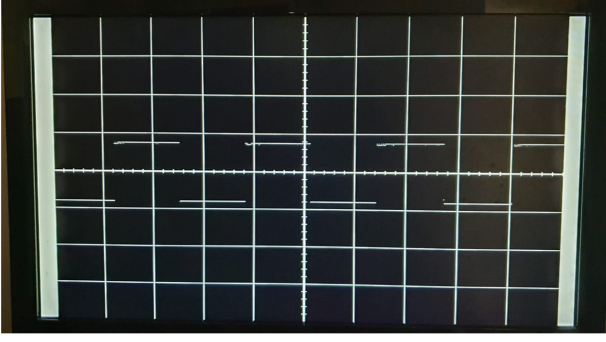
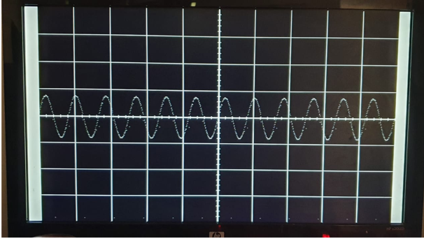
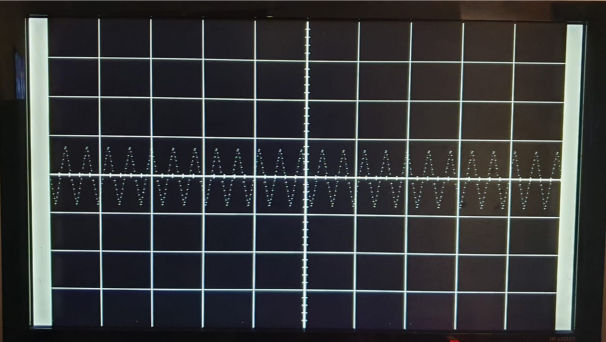

# FPGA-Based Oscilloscope

## Overview

This project implements a basic FPGA-based oscilloscope that captures ADC data and displays the waveform on a VGA monitor. The oscilloscope supports adjustable time and voltage divisions, AC/DC signal selection, and trigger functionality to stabilize the waveform. The design is implemented using Verilog and targets a 640x480 VGA display.

## Features

- **640x480 VGA Output**   : Real-time waveform display on a VGA monitor.
- **Time/Division Control**: Adjust time scale via knob input.
- **Volt/Division Control**: Adjust voltage scale via knob input.
- **AC/DC Selector**       : Switch between AC and DC signal acquisition.
- **Triggering**           : Stabilize waveform display with trigger threshold.
- **Dual-Port Block RAM**  : Temporarily store ADC samples using Xilinx BlockRAM IP.
- **FPGA Clock Generation**: Two clocks (25MHz for VGA and 16MHz for Atmega328).

## Inputs/Outputs

### Inputs:
- `clk`         : 50MHz main clock input to the FPGA.
- `addata`      : 8-bit ADC data input.
- `AC_DC_Select`: Select between AC or DC coupling for the input signal.
- `trigger`     : Set the trigger level for waveform capture.

### Outputs:
- `VGA_R`    : 5-bit red signal to VGA.
- `VGA_G`    : 6-bit green signal to VGA.
- `VGA_B`    : 5-bit blue signal to VGA.
- `VGA_HSYNC`: Horizontal sync signal to VGA.
- `VGA_VSYNC`: Vertical sync signal to VGA.

## Project Structure

- `src/`         : Contains Verilog source files for the FPGA implementation.
- `sim/`         : Testbenches and simulation scripts. (to be added)
- `constraints/` : XDC constraint files for pin assignments and clock configurations.
- `docs/`        : Documentation related to the project.
- `gallery`      : images and video demo

## Building and Running

### Prerequisites:
- Xilinx Ise 14.1
- AX309 FPGA Dev Board & Kit with AMD Spartan™ 6 XC6SLX9
- AN108 8bit 32MSPS AD to125MSPS DA module
- VGA monitor and compatible cable

## Images

### 10KHz Square Wave (38.4 us/div & 1.25V/div)

### 500KHz Sine Wave (2.4 us/div & 1.25V/div)

### 1MHz Triangular Wave (2.4 us/div & 1.25V/div)

## Video

### demo video

## Future Plans

- porting this whole design on zedboard
- implementing knobs control via web-based gui
- improving signal display
